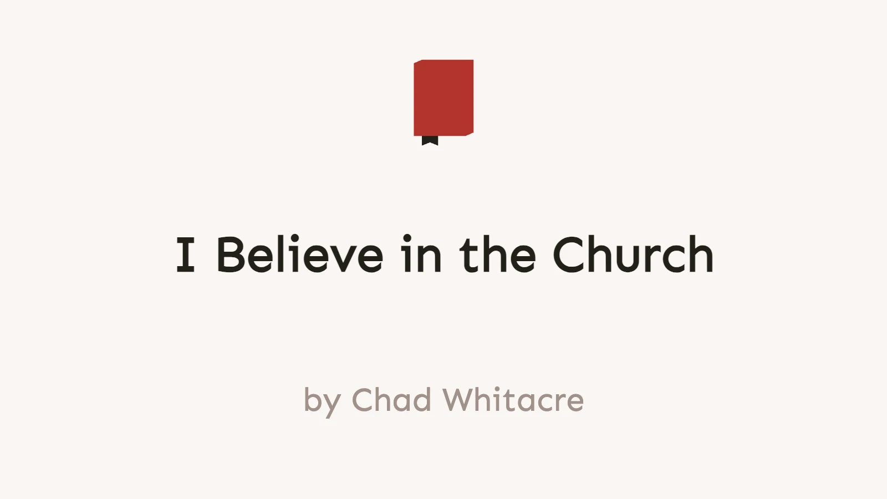

Specific is terrific. Thus taught my high school English teacher. She was
referring to composition, but I think about her words when thinking about the
Church. The Church is specific. I am a member of St. Nicholas Orthodox Church
in McKees Rocks, under Fr. Thomas Soroka. We are a parish in the Archdiocese of
Pittsburgh and Western Pennsylvania, under His Eminence, Archbishop
Melchisidek. The Archdiocese belongs to the Orthodox Church in America, under
His Beatitude, the Most Blessed Tikhon, Archbishop of Washington, Metropolitan
of All America and Canada. The OCA understands itself to be autocephalous,
though of course this is not acknowledged by all of the other churches.

### Servant of Unity

I love His Beautitude's statement that the OCA is the servant of unity, not the
master. I think this applies at all levels:

- jurisdictions
- christians
- all peoples

For me, the Church has spiritual authority over:

- 150,000 souls, not 150
- 5,000,000 souls, not 5,000
- 500,000,000 souls, not 100,000
- 8,000,000,000 souls, not 200,000,000

### Specific is Terrific

My own engagement with the church looks like this:

- worship
- fellowship
- friendship
- men's group
- icons

My daughter is with me which is so wonderful. As with our world, our household
is divided. We are the servant of unity in our own household. Love your enemies
and pray for those who persecute you.
