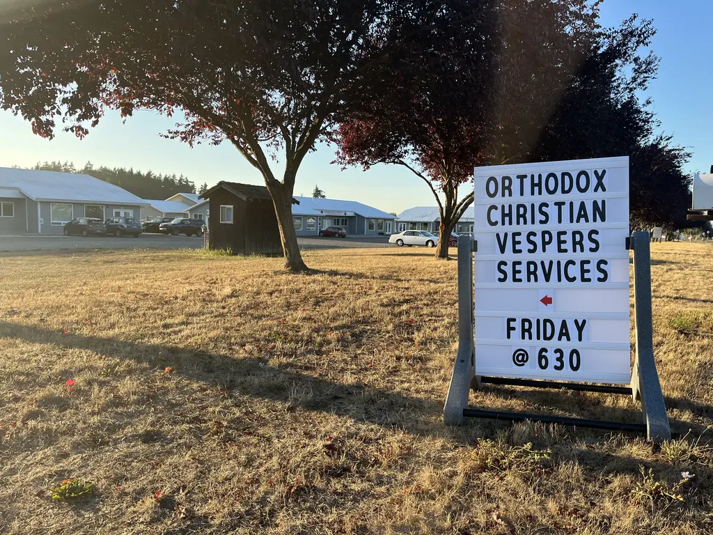
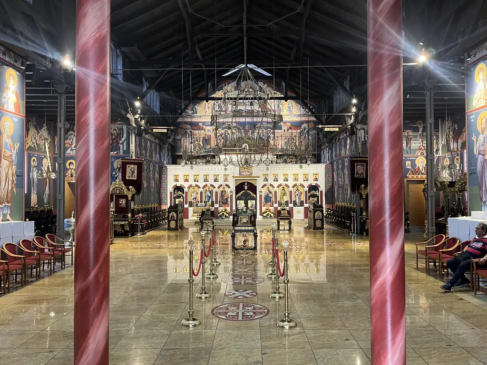
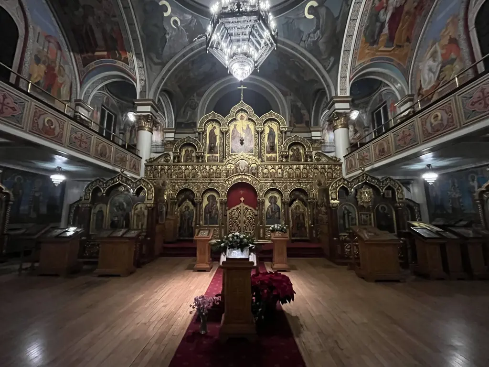
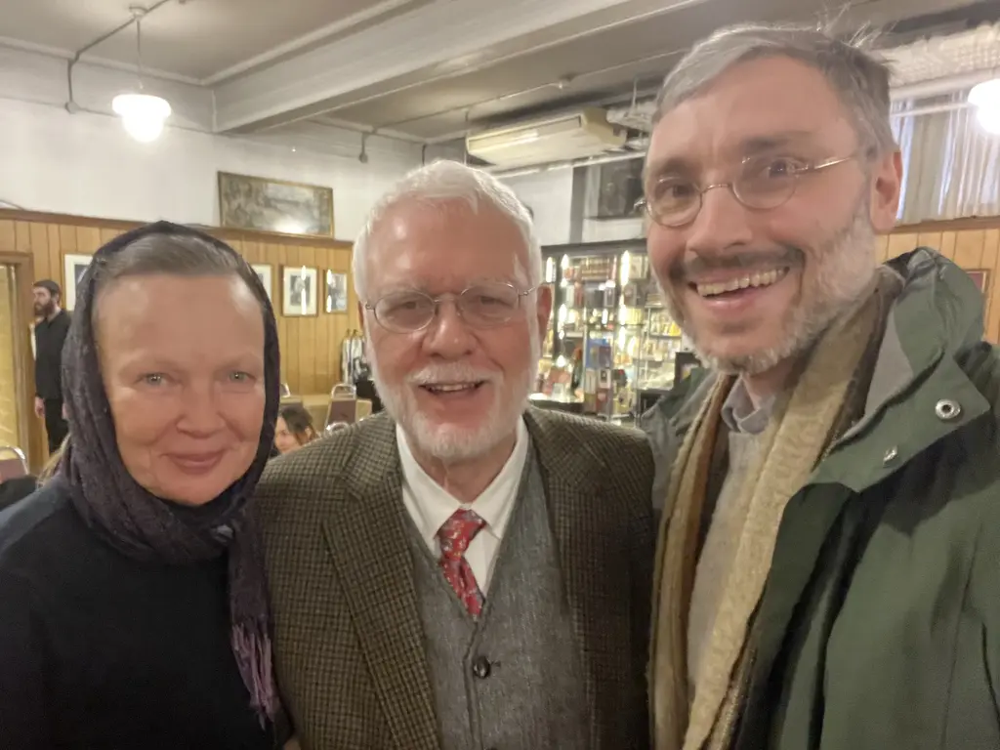

<link rel="stylesheet" href="/assets/glide-3.7.1.css">



I really love the Church, especially the local parish, my own and others.  When
I see Orthodox-adjacent content creators like [Charls
Caroll](https://www.youtube.com/watch?v=tUmTqIg_lrk) or [Jordan
Peterson](https://open.spotify.com/episode/4IQvrirSZJ4wUGYhNjz8dX) or [Peter
Heers](https://www.assemblyofbishops.org/news/2023/communique-04202023)
receiving attention online, I shake my head and think, “Wow, I hope these guys
are as active in a local parish as they are online.” I know for myself the
Internet is a mixed blessing. Yes, I can communicate with you all who are
reading this right now. Don’t take this the wrong way, but honestly you’re way
less important to me than the people in my parish. I hope I am less important
to you than those in yours! The local parish is a countercultural gift from God
in our fractured, lonely age.

### My Responsibilities at My Parish

At [my parish](https://orthodoxpittsburgh.org/), I’ve been given responsibility for the men’s group. We have about
50 members; maybe a dozen show up in any given month. Our meetings are simple.
On the first Thursday of the month, we open up the parish house at around 7:00
PM. We eat and drink and talk and laugh and argue and pray until we’re done. At
our most recent meeting, three of us said a closing Trisagion at about 1:00 AM.
I got home at 2:50 AM, after sitting in my driveway for over an hour with one
of our inquirers who caught me up on some truly wild events in his life since
the last time we saw each other six months ago.

    

Another way I’m blessed to serve at my parish is by holding the cloth during
the Eucharist. It is humbling and moving to be there at my priest’s side, or
with one of our deacons, during the moment of Communion. My brothers and
sisters come forward, state their Christian name, and receive the Body and
Blood of Christ. It’s one of the most meaningful things in my life, to be
honest—such an honor! Now that I think about it, it really is a foretaste of
what I talked about in my last post, [presenting each other as pure offerings to
God on the Day of Christ](/2024/lets-be-holy-together/). Wow!

Our parish also has an icon stand dedicated to the [Twelve Faithful
Servants](/the-twelve-faithful-servants/). I rotate their icons during the
year. This is a significant way in which, as my bishop says, Gospel Desk is
“[of the Church](/about/).” When I share further afield, especially here
online, I hope I do so as one deeply rooted in my parish family.
 
There are many other ways I share in the life of my parish, but these are my
main responsibilities.

### Visiting Other Parishes

I also love other parishes. I travel a fair bit for work, and I find it really
enlivening to seek out the Church in whatever city I find myself. I usually
text home a picture with the caption, “I have established contact with the
brethren.”

  

    <ul class="glide__slides">
		<li class="glide__slide"></li>
		<li class="glide__slide"></li>
		<li class="glide__slide"></li>
		<li class="glide__slide"></li>
		<li class="glide__slide"></li>
		<li class="glide__slide"></li>
		<li class="glide__slide"></li>
		<li class="glide__slide"></li>
		<li class="glide__slide"></li>
		<li class="glide__slide"></li>
		<li class="glide__slide"></li>
		<li class="glide__slide"></li>
		<li class="glide__slide"></li>
		<li class="glide__slide"></li>
		<li class="glide__slide"></li>
		<li class="glide__slide"></li>
		<li class="glide__slide"></li>
		<li class="glide__slide"></li>
		<li class="glide__slide"></li>
		<li class="glide__slide"></li>
		<li class="glide__slide"></li>
    </ul>
  

  

    <button class="glide__arrow glide__arrow--left" data-glide-dir="<"> Previous</button>
    <button class="glide__arrow glide__arrow--right" data-glide-dir=">">Next </button>
  

Here are the parishes outside of my diocese that I’ve been blessed to visit
over the past four years (more or less in the order I first visited them):

1. [Holy Virgin Cathedral, Joy of All Who Sorrow, San Francisco](https://sfsobor.com/) (ROCOR)
1. [Holy Trinity Cathedral, San Francisco](https://holy-trinity.org/) (OCA)
1. [St. John the Baptist, Berkeley](https://stjohnthebaptistberkeley.org/) (OCA)
1. [St. Seraphim Cathedral, Santa Rosa](https://saintseraphim.com/) (OCA)
1. [St. Anthony, Hendersonville](https://saintanthonyorthodoxwnc.org/) (ACROD)
1. [St. Vasilios, Watertown](https://saintvasilios.org/) (GOA)
1. [St. Sophrony, Sequiem](https://orthodoxsequim.com/) (OCA)
1. [St. Herman, Port Townsend](https://orthodoxporttownsend.com/) (OCA)
1. [St. Spiridon Cathedral, Seattle](https://saintspiridon.org/) (OCA)
1. [St. Nicholas Cathedral, Seattle](https://www.saintnicholascathedral.org/) (ROCOR)
1. [St. Nicholas Cathedral, Washington, D.C.](https://www.stnicholasdc.org/) (OCA)
1. [St. Nicholas, New York City](https://stnicholaswtc.org/) (GOA)
1. [Resurrection of Christ, Vienna](http://www.crkva.at/parohije/bec/) (Serbian)
1. [Holy Transfiguration, Raleigh](https://www.holytransfiguration-oca.org/) (OCA)
1. [Sts. Peter and Paul, Jersey City](https://www.peterandpaulcathedral.com/) (OCA)
1. [Holy Trinity, Toronto](https://www.holytrinity.ws/) (ROCOR)

I’ve met so many wonderful brothers and sisters at these parishes. It’s the
main thing I look forward to when traveling. It’s how I book my trips: flight,
hotel, and parish. I’ve traveled enough to San Francisco that Holy Trinity
Cathedral has become a home away from home. Relationships with several
parishioners there have deepened into friendships. My hope is that some day I
can visit these parishes and others with the [Faithful
Servants](/the-twelve-faithful-servants/) icons.

### The Hard Parts

Loving and believing in the Church comes with complexities for me. How do I
relate to those outside the Church? How do I approach creative and
not-so-creative tensions within the Church?

I have lots of family, friends, neighbors, and coworkers who are not Orthodox.
In fact, that’s pretty much all I have. Most of you who subscribe to the Gospel
Desk email list, for example, are not Orthodox. Certainly most of the world to
whom a public blog is available are not Orthodox.

I whole-heartedly believe the Orthodox Church’s identification of
itself with the one, holy, catholic, and apostolic Church of the Nicene Creed,
exclusive of other bodies. I also want to be gracious, kind, and meek. I don’t
want to be argumentative, especially online. I want to share fellowship with my
non-Orthodox family, friends, neighbors, and coworkers to the greatest extent
possible. This is a weighty tension for me, between togetherness and
distinctiveness.

Addressing myself to the brethren (forgive me, non-Orthodox friends)—given
that we _are_ the Church:

- Is Fr. Tom the pastor of the 150 souls in St. Nicholas
parish, or the 150,000 souls living within the neighborhoods of Pittsburgh from
which we draw?
- Is Archbishop Melchisidek the bishop of 5,000 people on the
diocesan rolls, or an apostle of Christ to 5,000,000 within his diocesan
territory?
- Is Metropolitan Tikhon shepherding 85,000 adherents, or laboring in
a field of 500,000,000, white for harvest?

At every level, the answer is both, and in this I feel a creative tension, an
energizing opportunity. It doesn’t take much salt to season, or much yeast to
leaven. How can we as the Church continually engage more fully in the Great
Commission?

### The Really Hard Parts

There are less happy tensions within the Church. Improprieties of various kinds
lurk in the hierarchical shadows, at times flaring up into scandals of abuse.
We are currently beset by a terrible schism pitting one aberation
(ethnophyletism) against another (false ecumenism). Downstream of this schism
are the jurisdictional irregularities across the globe that the Great and Holy
Council, only partly realized, was intended to address.

As a recent convert, I find it intimidating enough to grow into the abundant
life of what is genuine in the Faith. Discovering and navigating Orthodoxy’s
geopolitical minefield is shocking and discouraging. I confessed outright to
one of the Russian priests I met—who was wonderfully kind in response—that I
was scared of him, of trying to find a footing as an American convert in a
wider Orthodox world [storm-tossed between Moscow and
Constantinople](https://www.orthodoxhistory.org/2023/07/19/how-did-orthodoxy-get-into-this-mess/).

### Approaching the Hard Parts

What do I do with the mess in the Church? I have no authority. I’m not directly
responsible for resolving any of this. I do think it’s right for me to be
informed, especially since I’m publishing more, and traveling. I find [Matthew
Namee’s writings](https://www.orthodoxhistory.org/) helpful, on
[recent Orthodox
history](https://www.orthodoxhistory.org/2023/07/19/how-did-orthodoxy-get-into-this-mess/)
and the [history of
autocephaly](https://www.orthodoxhistory.org/2022/05/24/when-did-todays-autocephalous-churches-come-into-being/)
in particular.

You know what happened right after I filmed the footage for the above feel-good
video? My buddy and I failed to fix our church’s leaky roof. We wrestled with a
borrowed commercial ladder for an hour, then decided to fight again another
day.

    

You know what happened at our most recent men’s fellowship? One of our
inquirers got so upset that he cursed us and stormed out. He and I met a couple
days later to patch things up. We still have a long way to go. These challenges
aren’t accidental, they’re essential to the purpose and meaning of parish life.
Patiently awaiting God’s redemption is the meaning of life.

The same is true at higher levels of Church structure. My best contribution as
a layman is to pray for our hierarchs—really, genuinely love and pray for
them—and fulfill my own responsibilities under my own priest and bishop.

The tensions I’ve identified have always been present. Christ came not to bring
peace but a sword. We’re engaged in a struggle not against flesh and blood.
Once upon a time, the whole world groaned and was astonished to find itself
Arian. God isn’t surprised. He leads and guides His Church, and the gates of
hell will not stand against us.

It fills my life with meaning and joy to participate in the Church as a member
of my parish: in Liturgy and in service to others, in work and in rest, in
fasting and in feasting, in patient endurance and in glimpses of glory, in
death and in resurrection. I believe in the Church, complexities and all.
Christ is in our midst!
