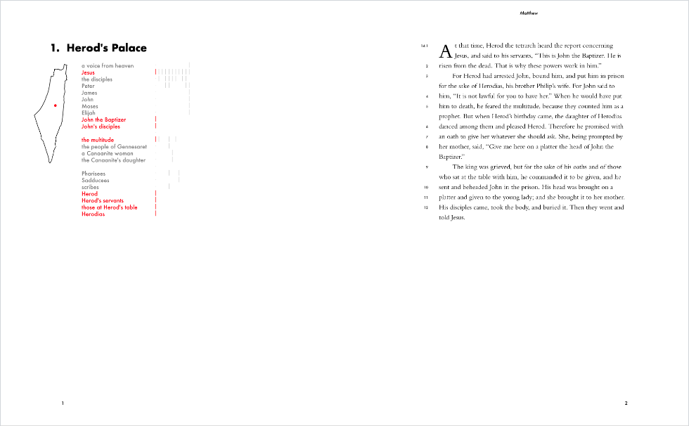
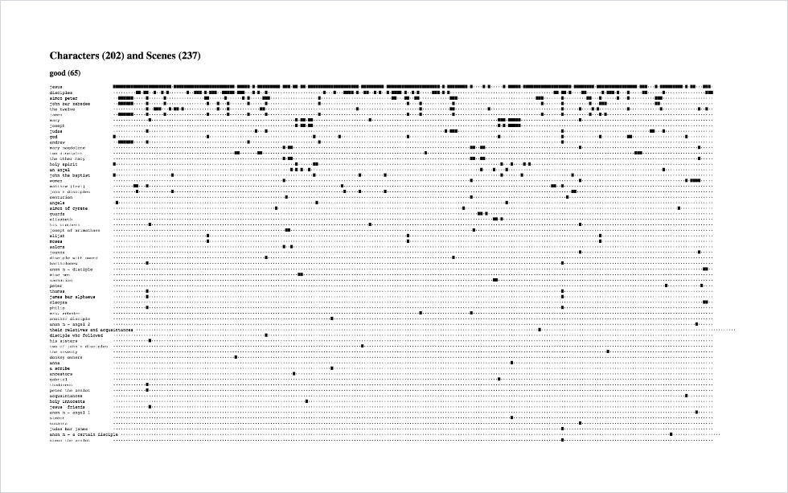

[The Gospels](/the-gospels) lays out Mark, Matthew, Luke, and John in a way
that is easy to read straight through as a story. <cite>The Gospels, with a
Narrative Apparatus</cite> has an opposite goal: to visualize the narrative
structure of the Gospels in fine detail.

This project is in its early stages, starting with the compilation of a dataset
of characters, frames and scenes in the Gospels. I am looking into writing
[specialized software](/updates/2020/the-abstractinator/) to aid in compiling
this dataset. Lord willing, it will provide a solid foundation for many
fruitful analyses, such as [The Twelve Believers](/the-twelve-believers/).

#### Prototypes

