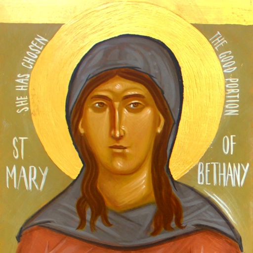

[The Gospels](/the-gospels/) tell the story of Jesus, the Son of God, with the
intention that we would believe in him, and that, believing, we would have life
in his name. What does belief look like? In the Gospels, there are twelve
people whom Christ directly, explicitly <u>praises</u> for their <u
class="blue">faith</u>. Just as Jesus calls the Twelve Apostles, so also there
are another Twelve who <u class="blue">call</u> on Jesus and are
<u>answered</u>, providing a clear picture of devotion for all Christians to
follow.

#### Who are the Twelve Believers?

##### The Defiant 

Women with nothing left to lose, they defy onlookers to
boldly approach Jesus.

<table class="twelve-believers">
  <tr>
    <td>
      <a href="./st-justa/">
        
        St. Justa
        The Canaanite Woman
      </a>
    </td>
    <td>
      <a href="./st-veronica/">
        
        St. Veronica
        The Woman with a Flow of Blood
      </a>
    </td>
    <td>
      <a href="./the-sinful-woman/">
        
        The Sinful Woman
        Forgiven by Christ
      </a>
    </td>
  </tr>
</table>

##### The Outcast 

Men without worldly advantages, they beg Jesus for mercy
and are answered.

<table class="twelve-believers">
  <tr>
    <td>
      <a href="./st-dysmas/">
        
        St. Dysmas
        The Penitent Thief
        (a.k.a. St. Rakh)
      </a>
    </td>
    <td>
      <a href="./the-samaritan-leper/">
        
        The Samaritan Leper
      </a>
    </td>
    <td>
      <a href="./st-bartimaeus/">
        
        St. Bartimaeus
        The Blind Beggar
      </a>
    </td>
  </tr>
</table>

##### The Powerful

Wealthy and of high standing, they show that all things
are possible with God.

<table class="twelve-believers">
  <tr>
    <td>
      <a href="./the-centurion/">
        
        The Centurion
      </a>
    </td>
    <td>
      <a href="./st-zacchaeus/">
        
        St. Zacchaeus
        The Son of Abraham
      </a>
    </td>
    <td>
      <a href="./the-wise-scribe/">
        
        The Wise Scribe
      </a>
    </td>
  </tr>
</table>

##### The Familiar
   

Close friends of Jesus, they are Apostles and Equal of the Apostles.

<table class="twelve-believers">
  <tr>
    <td>
      <a href="./st-nathanael/">
        
        St. Nathanael
        The True Israelite
        (a.k.a. St. Bartholomew)
      </a>
    </td>
    <td>
      <a href="./st-peter/">
        
        St. Peter
        The Blessed
      </a>
    </td>
    <td>
      <a href="./st-mary-of-bethany/">
        
        St. Mary of Bethany
        The Twice-Praised
      </a>
    </td>
  </tr>
</table>
